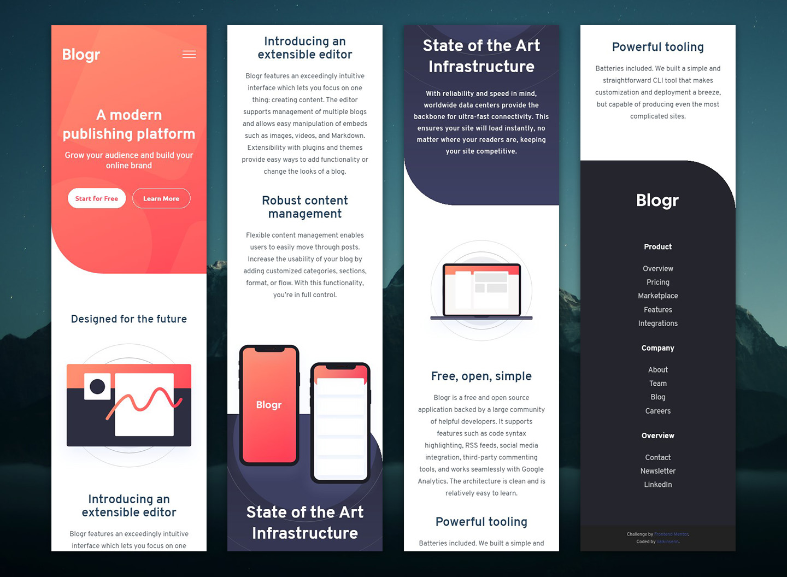
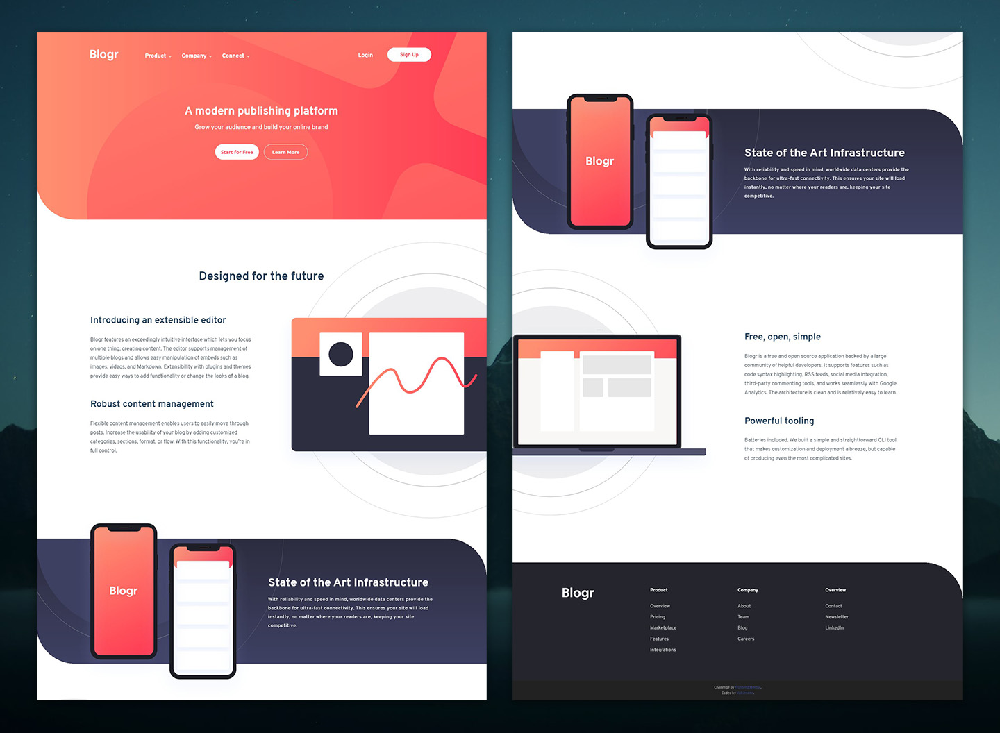

# Frontend Mentor - Blogr landing page solution

This is my solution to the [Blogr landing page challenge on Frontend Mentor](https://www.frontendmentor.io/challenges/blogr-landing-page-EX2RLAApP). If you're interested in honing your frontend skills, be sure to stop by Frontend Mentor.

## Table of contents

- [Overview](#overview)
  - [The Challenge](#the-challenge)
  - [Screenshots](#screenshots)
  - [Links](#links)
- [My process](#my-process)
  - [Built with](#built-with)
  - [What I learned](#what-i-learned)
  - [Continued development](#continued-development)
  - [Useful resources](#useful-resources)
- [Author](#author)
- [Acknowledgments](#acknowledgments)

## Overview

### The Challenge

Users should be able to:

- View the optimal layout for the site depending on their device's screen size.
- See hover states for all interactive elements on the page.

### Screenshots

#### Mobile Screenshot

#### Desktop Screenshot

### Links

- Solution URL: [Add solution URL here](https://your-solution-url.com)
- Live Site URL: [Add live site URL here](https://your-live-site-url.com)

## My process

### Built with

- HTML5
- Custom CSS through SASS
- Mobile-first design
- CSS Flexbox
- CSS Grid
- JavaScript

### What I learned

For starters, on top of what I know about layouts, I learned one very valuable lesson: if you're fighting with Grid, you're using it wrong. Also, I learned how to have dropdown menus on responsive navbars.

### Continued development

Use this section to outline areas that you want to continue focusing on in future projects. These could be concepts you're still not completely comfortable with or techniques you found useful that you want to refine and perfect.

### Useful resources

- [CSS Tricks | The "Checkbox Hack"](https://css-tricks.com/the-checkbox-hack/) - Even if I did something different for my solution, this was essentially a fantastic starting point for understanding how to make this happen with as little JavaScript as possible.
- [CSS Tricks | A Complete Guide to Grid](https://css-tricks.com/snippets/css/complete-guide-grid/) - Pretty much par for the course, but this is instrumental for anyone looking to use CSS Grid.
- [David Walsh | Pure CSS Slide Up and Down](https://davidwalsh.name/css-slide) - Pretty much how I was able to make the rollup animations on the navbar work.
- [Stack Overflow | Transitions effects on scrollbars](https://stackoverflow.com/a/46304690) - This helped me figure out how to have custom scrollbars that fade in and out whenever a user hovers over the web page.

## Author

- Website - As soon as I finish my portfolio, I'm gonna turn _all_ of my attention to this.
- Frontend Mentor - [@valkinsenn](https://www.frontendmentor.io/profile/valkinsenn)
- Twitter - [@valkinsenn](https://www.twitter.com/valkinsenn)

## Acknowledgments

- **CSS Tricks** - A fantastic site for researching various topics, tips, and tricks related to CSS and even JavaScript.
- **Kevin Powell** - Once again, I have to give a major shoutout to the undisputed *king* of CSS. His tutorials have proven invaluable to me in my journey as a frontend web designer and developer.
